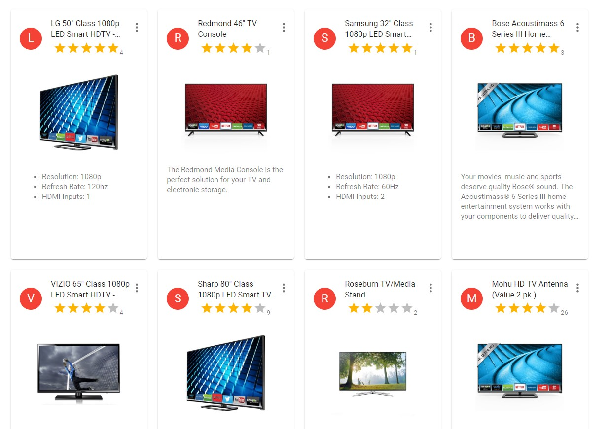
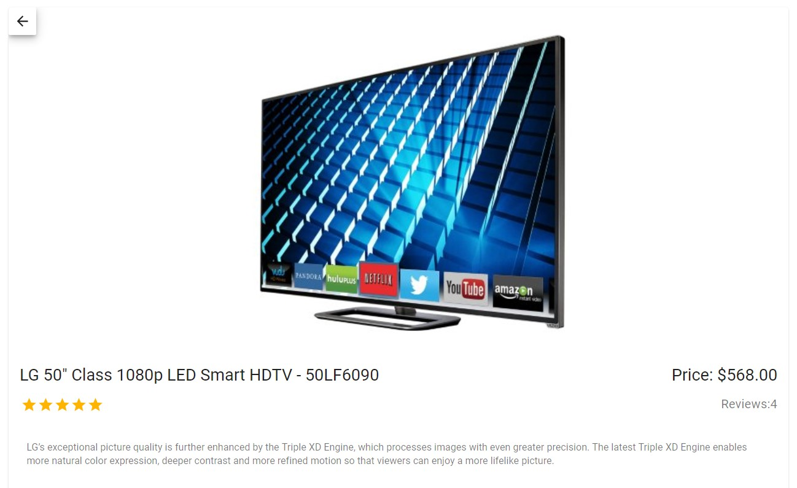

# Walmart


Scalability & Modularity are taken into consideration while developing this application.

- Card View with skeletal Loading
- Product Gallery

### Landing Page:



### Product Details Page:



### WorkFlow

```sh
>> Fetches Data from Endpoint
>> Mapped to UI Components
>> Redux-thunk is used as the middleware
>> React Router is used
>> Loading - skeletal material UI
>> Responsive UI
>> Pagination API
```

### Tech

Walmart uses a number of open source projects to work properly:

- [ReactJS] - FrameWork enhanced for web apps!
- [Material UI] Material-UI is an open-source project that features React components.

And Walmart is a Repo on GitHub.

### Installation

Walmart requires [Node.js](https://nodejs.org/) v4+ to run.

Install the dependencies and devDependencies and start the server.

```sh
 cd walmart-labs
 npm install
 npm start
```

### Todos

- Include more features
- Utilize the renditions
- Improve performance
- UI/UX Enhancements

## License

MIT
